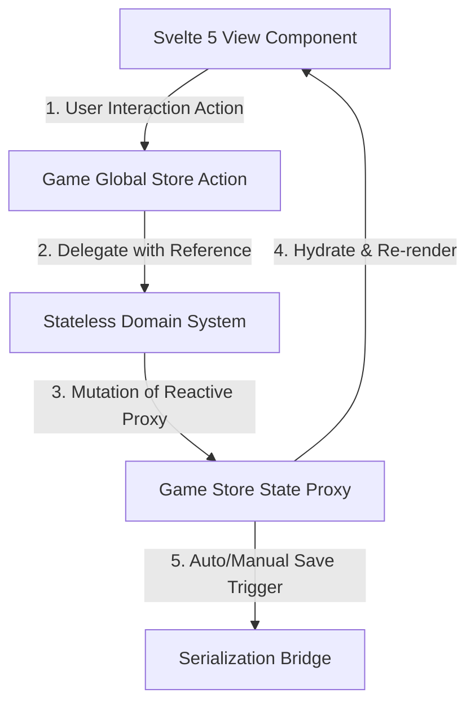
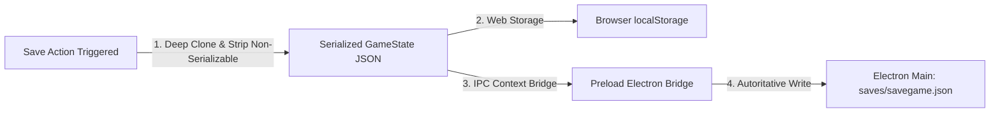
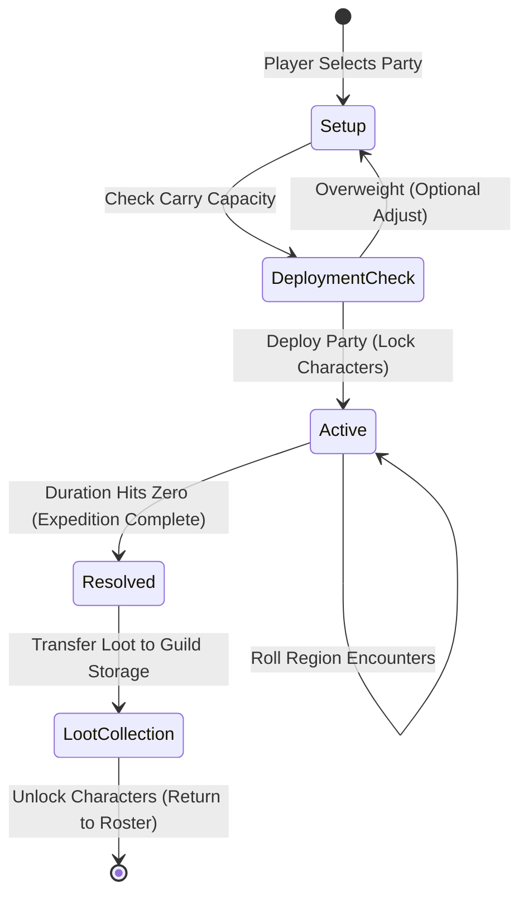

# STATEFLOW.md — The Last Guildmaster State Flow Architecture

This document describes the reactive state cycle, data transmission flows, execution heartbeats, and save persistence pathways of **The Last Guildmaster**.

---

## 1. The Reactivity Cycle

The game uses Svelte 5's `$state` runes for reactive UI binding combined with stateless domain managers that execute mutations.



1. **User Interaction**: Components (e.g. `Inn.svelte`, `Storage.svelte`) listen to event triggers and invoke actions directly on the global `Game` store.
2. **Delegation**: The `Game` store action forwards the mutable `$state` reference to a stateless system (e.g., `storage.system.ts`, `roster.system.ts`).
3. **State Mutation**: The domain system performs validation checks and directly mutates the state property.
4. **Reactive Render**: Svelte's runtime captures the mutation and automatically schedules component updates.
5. **Persistence**: At defined intervals, the serialized state is sent across the preload bridge to be written to disk.

---

## 2. Boot & State Initialization Flow

Upon launching the application, the following sequence resolves to transition from storage to active simulation:

```mermaid
sequenceDiagram
    participant Main as Electron Main Process
    participant Preload as Preload Bridge (IPC)
    participant GameStore as Game Svelte Store
    participant Migrator as Migrations Engine
    participant UI as Svelte Render Tree

    GameStore->>Preload: loadGame()
    Preload->>Main: IPC: request-load-save
    Main-->>Preload: Returns raw JSON / Error
    Preload-->>GameStore: Raw Save JSON
    
    rect rgb(30, 41, 59)
        note over GameStore, Migrator: Validation & Upgrade Phase
        GameStore->>Migrator: migrateSave(rawSave)
        Migrator-->>GameStore: Upgraded V1 Schema State
    end

    rect rgb(17, 24, 39)
        note over GameStore: Offline Simulation Phase
        GameStore->>GameStore: Calculate Real-Time Delta Ticks
        GameStore->>GameStore: Simulate Elapsed Clock Transitions (Time/Tavern/Expedition)
    end

    GameStore->>UI: Hydrate Store State ($state)
    UI->>UI: Render Main Menu & Guild Hall
```



1. **Fetch**: The renderer store asks the context bridge to load the save file. If the native file is missing, it falls back to the browser's `localStorage` key.
2. **Migration**: The schema version is read. If it is older than the current schema, sequential migration functions are applied to normalize the fields (e.g., adding slot-based storage data structures, grouping character data).
3. **Catch-up**: The current time is compared to the saved time. If a gap exists, the engine runs time ticks sequentially, accumulating tavern income and passive recruitment cycles.
4. **Hydration**: Svelte's state object is assigned the final migrated state, triggering UI rendering.

---

## 3. The Time Heartbeat Flow

The game time heartbeat runs on a delta-based clock loop to prevent execution drifting under processor lag or tab sleep:

```mermaid
graph TD
    A[setInterval Heartbeat 1000ms] -->|1. Compute performance.now delta| B{Delta >= 1000ms?}
    B -- No --> C[Wait Next Frame]
    B -- Yes -->|2. Calculate Tick Count| D[Simulate Ticks Sequentially]
    D -->|advanceTick()| E[state.world.time.tick++]
    E -->|3. Tick >= 60| F[Rollover tick = 0, Trigger advanceHour()]
    F -->|processIncomeTick()| G[Gain Tavern Gold]
    F -->|checkPassiveRecruits()| H[Roll Tavern Walk-ins]
    F -->|4. Hour >= 24| I[Rollover hour = 0, Trigger advanceDay()]
    I -->|Reroll Weather| J[Roll daily weather PRNG seed]
    I -->|5. Day > 28| K[Rollover day = 1, trigger advanceMonth()]
```

---

## 4. Save Persistence Pipeline

State persistence writes concurrently to dual storage locations to prevent data loss:



1. **Serialization**: A deep-cloned JSON snapshot of the state is created. Reactivity markers are stripped.
2. **Local Write**: The JSON string is immediately cached in `localStorage` under `the_last_guildmaster_save`.
3. **Native Write**: The JSON payload is sent via IPC to the Electron main process, which writes it safely to `%APPDATA%/the-last-guildmaster/saves/savegame.json`.

---

## 5. Expedition Lifecycle State transitions

Expeditions transition through state steps mapping characters, inventories, and time:



1. **Setup**: The player assigns up to 4 adventurers from the active roster.
2. **Capacity Check**: Total gear weight is compared against the party's Strength-based carry limits.
3. **Deployment**: Characters are marked as `deployed: true`, locking them from being dismissed, re-equipped, or sent on other missions.
4. **Active Patrol**: The expedition record increments elapsed ticks. Encounter calculations check region spawn tables.
5. **Completion**: Upon reaching 0 seconds remaining, the expedition is marked as complete.
6. **Loot Processing**: Items are transferred to the slot-based Guild Storage. If storage is full, overflow items remain on the expedition queue until slots are freed.
7. **Unlock**: Characters are unlocked and returned to the active roster.
